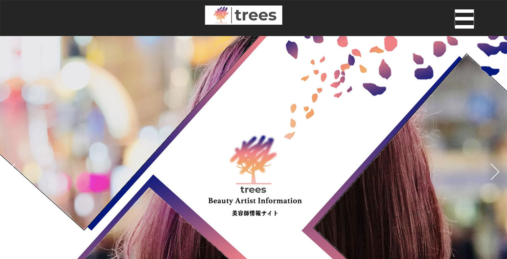
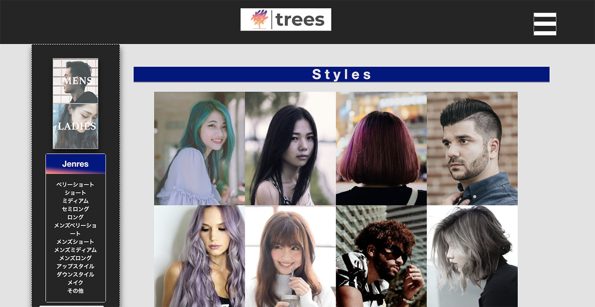
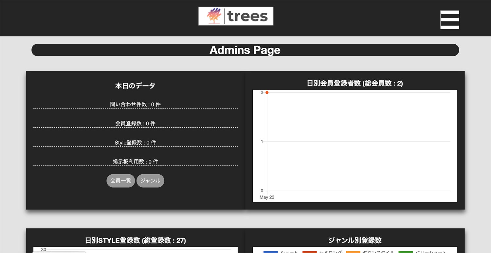

## サイトURL
- http://54.248.14.173/

## サイト概要・テーマ
美容師・ヘアスタイルなどの情報配信・コミュニケーションが取れるサイトです。
美容師は、ヘアスタイルの投票が可能です。また一般USERの方含め、掲示板の利用、
いいね機能・フォロー機能・チャット機能などが利用可能です。

## テーマを選んだ理由
製作者自身が元美容師だった為、美容師にとって役に立つツールを作りたかった為。
今美容業界は、フリーランスや面貸しなどここ最近いろいろな働き方が増えているので、
個人個人でアピールできるようなサイトを作りたかった。また一般の方と掲示板などで、
相談ができれば、集客の手助けになるかもしれないと思って作りました。

## ターゲットユーザ
- 美容師。すべての人。髪の毛で悩んでる人など。

## 主な利用シーン
- 美容師の情報。お気に入りのヘアスタイルを見つける。掲示板などを利用して相談ができる。

## 使用技術

### フロントエンド
- HTML&CSS
- Javascript
- Bootstrap

### バックエンド
- Ruby 2.5.7
- Rails 5.2.4.2

### テスト
- RSpec

### 環境
- 開発環境
Vagrant
- 本番環境・デペロイ
Aws(EC2,nginx)
Mysql

## 主な機能

### USE側
- MENS/LADIESに分けての検索
- ジャンルによる検索
- タグによる検索(gem acts-as-taggable-on)
- スタイル登録機能(写真3つまで)タグ付・編集・削除
- マイページ編集・パスワード編集・退会機能(論理削除)
- 掲示板機能・チャット機・フォロー機能・いいね機能
- 問い合わせ機能
- 会員登録時登録完了メール
- スタイル一覧はランダム表示(下記一覧画面)

### 管理者側
- アクティビティをチェックできるダッシュボード(グラフにchartkick使用)
- 会員の一覧・会員の削除
- ジャンルの追加・編集
- 下記管理者側top画面

## 設計書
デザインシート
https://drive.google.com/file/d/1_jlvMLjSYqZBu5OEA-3VShFUQEdGvDqr/view?usp=sharing

ER図
https://drive.google.com/file/d/1pf8AYatm80f-LFFmp6EItv2i0BfFe00C/view?usp=sharing

テーブル設計
https://docs.google.com/spreadsheets/d/1PPNvsX8mkjDw_icuIsHsDHLpaR4IQDBzh74kAa3xowc/edit?usp=sharing

ルーティング設計図　or GEM
https://docs.google.com/spreadsheets/d/1Fk75pSmq93VWG5b7m36XLBLA88GVgMtBcux5CV5dY9Y/edit?usp=sharing

### 機能一覧
https://docs.google.com/spreadsheets/d/1UWyZ-NsPuoSW3AeX_YhjPh92uatm95GNJLO4l3Bv_hE/edit?usp=sharing

